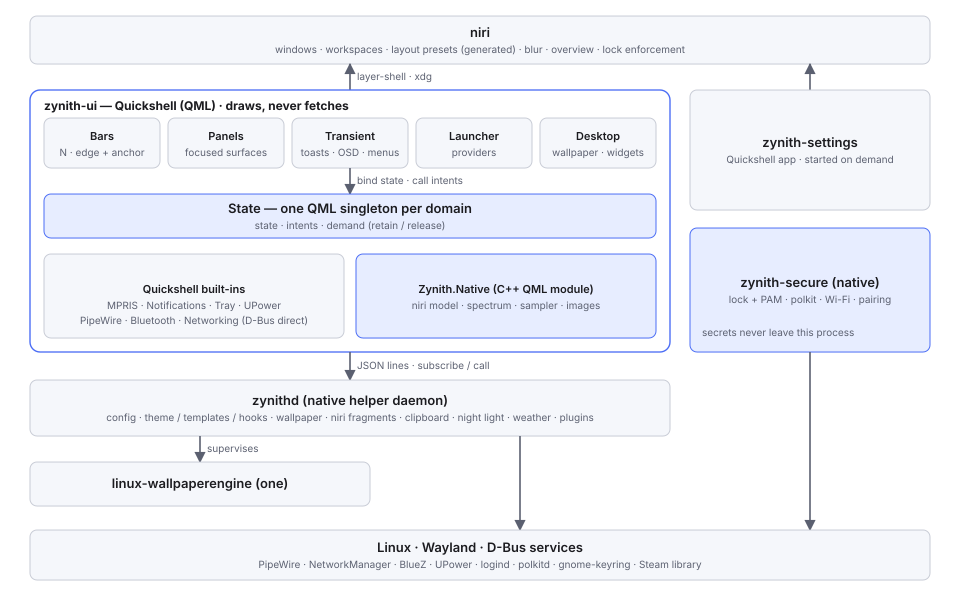

# Zynith Architecture 2.0 — proposal (2026‑10‑02)

**Status: ACCEPTED as the implementation direction (2026‑10‑02); implementation started.** The §18 decisions were made the same day (GPL‑3.0, spike approved, overview option A, keep Luau, deferred features, a Tiling-like preset, removing the stale Quickshell). What exists so far: [Stage 1 implementation record](zynith-2.0-stage1-2026-10-02.md); measurements: [spike benchmark](../03_Performance/benchmarks/zynith-ui-spike-2026-10-02.md). Sections below still describe the target, not what exists. I asked for an architecture that is more modular, easier to
understand and primarily Quickshell-oriented, derived from evidence rather than taste. Claude drafted it from three
inputs: what exists ([current architecture](Zynith-Current-Architecture.md)), what Quickshell can and cannot do
([Quickshell study](Zynith-Quickshell-Architecture-Study.md)), and how the reference shells are built
([reference rice study](Zynith-Reference-Rice-Study.md)). Decisions that are mine to make are collected in §18.

## 1. Principles

| Principle | What it means in this architecture |
|---|---|
| event-driven > polling | state changes arrive as events (D-Bus signals, PipeWire, niri event stream, inotify); no timer in the UI reads the system |
| shared state > duplicated state | one service per domain, one owner per state; surfaces bind, they never fetch |
| visible work > invisible work | expensive producers run only while a visible consumer holds them (demand counting) |
| critical path > background work | the first frame needs the wallpaper and the bar, nothing else; everything else starts after |
| bounded concurrency > uncontrolled concurrency | fixed worker pools; one live renderer; one template run at a time |
| one owner per role | exactly one notification server, tray watcher, polkit agent, secret agent, session lock |
| secrets never in QML | password entry happens in native code that can wipe it |
| UI is declarative | surfaces are QML views of state; behaviour that is not presentation lives below them |

## 2. The map

```
Zynith
├── Surfaces             UI · Quickshell/QML · draws, never fetches
│   ├── Bars             any number; each = edge + anchor + widgets
│   ├── Panels           focused surfaces: Home · Notifications · Quick Settings · Media · Wallpaper · System
│   │                    · Clipboard · Network · Bluetooth · Calendar
│   ├── Transient        toasts · OSD · tooltips · menus · confirmations
│   ├── Launcher         one search surface, many providers
│   └── Desktop          wallpaper view · overview backdrop view · desktop widgets
├── Settings             separate app (own process, exits when closed)
├── Widgets              catalog of types; each placement lives in bar / panel / desktop config
├── State                one service per domain, the only thing surfaces read
│                        Session · Workspaces · Audio · Media · Network · Bluetooth · Power · Notifications
│                        · Clipboard · Wallpaper · Theme · System · Config
├── Native
│   ├── Zynith.Native    C++ QML module inside the UI process: niri model · spectrum · system sampler · images
│   ├── zynithd          native helper daemon: config writes · theme + templates + hooks · wallpaper + live
│   │                    renderer · niri fragments · clipboard history · night light · weather · plugins
│   └── zynith-secure    native process: session lock + PAM · polkit agent · Wi‑Fi secrets · Bluetooth pairing
│                        · idle → lock
└── External             niri · linux-wallpaperengine · PipeWire · NetworkManager · BlueZ · UPower · logind
                         · polkitd · gnome-keyring · Steam library
```

### Where does a feature belong?

| If it… | It belongs in | Example |
|---|---|---|
| draws something | **Surfaces** (QML) | a bar clock, the Media panel |
| holds data more than one surface uses | **State** (domain service) | volume, current player, wallpaper mode |
| reads hardware or runs ≥ 1 Hz | **Zynith.Native** (C++) | spectrum FFT, CPU sampler, niri event model |
| runs other programs, writes files or touches the network | **zynithd** | template hooks, config writes, plugin fetch, weather |
| touches a password or decides whether the session is locked | **zynith-secure** | lock, polkit, Wi‑Fi secrets |
| changes how windows behave | a **generated niri fragment** | animations, glass, window behaviour |
| is the compositor's or the system's job | **External**, consumed through its API | NetworkManager, logind |

## 3. Diagram



```
                         niri  (windows · workspaces · layout · blur · overview · lock enforcement)
                           ▲ layer-shell / xdg surfaces                         ▲ niri IPC · generated .kdl
┌──────────────────────────┴──────────────────────────────────┐                   │
│ zynith-ui  (Quickshell)                                      │  zynith-settings  │
│  Bars · Panels · Transient · Launcher · Desktop              │  (Quickshell app, │
│        │ bind state / call intents                           │   on demand)      │
│  State: one QML singleton per domain                         │                   │
│   ├─ Quickshell built-ins: MPRIS · Notifications · Tray ·    │                   │
│   │   UPower · PipeWire · Bluetooth · Networking             │                   │
│   └─ Zynith.Native (C++): niri model · spectrum · sampler    │                   │
└──────────────┬───────────────────────────────────────────────┘                   │
               │ JSON lines: subscribe <topic> · call <topic>.<method>             │
┌──────────────┴───────────────────────────────┐   ┌───────────────────────────────┴─┐
│ zynithd (native)                             │   │ zynith-secure (native,          │
│  config · theme/templates/hooks · wallpaper  │   │  non-dumpable)                  │
│  · niri fragments · clipboard · night light  │   │  lock + PAM · polkit · Wi‑Fi    │
│  · weather · plugins                         │   │  secrets · pairing · idle→lock  │
└──────┬───────────────────────────────────────┘   └───────────────┬─────────────────┘
       │ supervises                                                │
  linux-wallpaperengine (one)                                      │
       │                                                           │
  Linux · Wayland · D-Bus: PipeWire · NetworkManager · BlueZ · UPower · logind · polkitd · keyring · Steam
```

Three Zynith processes in the end state: **zynith-ui** (always), **zynithd** (always), **zynith-secure** (always),
plus **zynith-settings** while open. During migration zynithd and zynith-secure are the **existing shell**, reduced
step by step (§16).

## 4. State model

### 4.1 Domain service contract

Every domain is one QML singleton in zynith-ui with the same three parts:

| Part | Meaning | Rule |
|---|---|---|
| **state** | read-only properties (a snapshot) that notify on change | surfaces bind to these; nothing else is read |
| **intents** | methods that ask the owner to change something (`setVolume`, `connect`, `apply`) | never mutate state locally; the owner's update comes back as state |
| **demand** | `retain()` / `release()` for producers with a cost | a surface that is not on screen releases (the Phase 1 spectrum lesson) |

| Domain | Owner (source of truth) | Exclusive role? |
|---|---|---|
| Workspaces / windows | Zynith.Native niri model (event stream) | — |
| Audio (devices, volume) | Quickshell `Pipewire` | — |
| Spectrum | Zynith.Native (passive monitor stream, FFT, demand-counted) | — |
| Media | Quickshell `Mpris` | — |
| Notifications | Quickshell `NotificationServer` | **org.freedesktop.Notifications** |
| Tray | Quickshell `SystemTray` | **StatusNotifierWatcher** |
| Network | Quickshell `Networking` (state, scan, connect) + zynith-secure (secrets) | **NM secret agent** (secure) |
| Bluetooth | Quickshell `Bluetooth` + zynith-secure (pairing) | **BlueZ agent** (secure) |
| Power | Quickshell `UPower` (battery, profiles) | — |
| Session | zynith-secure (locked?, idle) + logind | **session lock** (secure) |
| System | Zynith.Native sampler (1 s while shown) + zynithd (static facts) | — |
| Clipboard | zynithd (watcher, encrypted history) | **data-control watcher** |
| Wallpaper | zynithd (§9) | **live renderer** |
| Theme | zynithd (palette, templates) | — |
| Config | zynithd (schema, validation, single writer) | **one writer per file** |

*Amended 2026‑10‑02: network state is read by Zynith.Native's `NetworkState`, not `Quickshell.Networking`, after the latter measured 68 wakeups/s on a campus network ([ADR‑0020](../05_Decisions/ADRs/ADR-0020-measure-builtins-before-adopting.md)).*

### 4.2 Transports

1. **In process**: QML bindings to Quickshell built-ins and Zynith.Native (zero copies, used for anything ≥ 1 Hz).
2. **Helper protocol** (zynithd, zynith-secure): JSON lines over a Unix socket in
   `$XDG_RUNTIME_DIR/zynith/`. `subscribe <topic>` returns a full frame, then a frame on every change;
   **identical frames are suppressed**. `call <topic>.<method> <json>` returns one reply. Every frame carries a
   `schema` version, and the UI refuses frames it does not understand. Ideas from Ryoku and Clavis, written fresh.
3. **Secrets never travel**: zynith-secure publishes only non-secret state (`locked`, `prompt pending`) and draws
   its own surfaces.

## 5. Panels (replacing the Control Center)

**Rule: one focused surface per job.** Each panel is its own layer surface, created per output on first open
(`LazyLoader`) and destroyed after a period of disuse. A **panel router** in zynith-ui handles
`open(id, {output, origin})`, `close`, `toggle` and `back`. By default one panel is open per output, so opening
another closes the first; a panel can be pinned. The `origin` is the element that opened it, so it can grow out of
that element (the September design work's "surfaces come from somewhere").

Panels own no data. Two panels that both show volume read the same Audio service. Panel-local state (scroll
position, an expanded row) is ephemeral; panel preferences are config.

| Today (Control Center tab or panel) | 2.0 surface |
|---|---|
| Home tab | **Home**: time, media glance, notification count, system status, weather |
| Notifications tab | **Notifications** |
| Audio tab (sliders), Power tab (profile) | **Quick Settings**: volume, brightness, toggles, power profile |
| Media tab | **Media** |
| Network tab | **Network** (Wi‑Fi password prompts come from zynith-secure) |
| Bluetooth tab | **Bluetooth** (pairing prompts come from zynith-secure) |
| Monitor, System, Screen-time tabs | **System** |
| Calendar, Weather tabs | **Calendar** (weather also on Home) |
| wallpaper panel | **Wallpaper** |
| clipboard panel | **Clipboard** |
| session panel | power menu (transient) |
| launcher | **Launcher** |

Every panel has: an id; entry points (bar widget, IPC/keybind, launcher command, deep link from another panel or
from Settings); a size class; a keyboard mode (none, on-demand, exclusive).

## 6. Multiple independent bars

Bars are already multiple today; what is missing is **anchoring along the edge**. Proposed model:

```toml
[[bars]]
id         = "media"
edge       = "top"          # top | bottom | left | right
anchor     = "center"       # start | center | end | fill
length     = "auto"         # auto (content) | px | fraction 0..1
offset     = 0              # along the edge, away from the anchor
margin     = 0              # from the screen edge; > 0 floats the bar
thickness  = 36
outputs    = ["*"]
reserve    = false          # exclusive space
layer      = "top"
visibility = "smart"        # always | autohide | smart (hidden while windows) | ipc
style      = { surface = "glass", opacity = 0.62, radius = [0, 0, 18, 18], shadow = "contact" }
motion     = { enter = "spatial.enter", exit = "spatial.exit" }
widgets    = { start = [], center = ["media", "audio_visualizer"], end = [] }
```

Rules:

- One layer surface per bar per output. `start`/`end` anchor to the corner of the edge, `center` centres, `fill`
  spans the edge. `length = "auto"` sizes from content.
- **Exclusive space belongs to the edge, not the bar.** If several bars on one edge reserve space, only the largest
  reservation is applied (one bar carries it). Whether niri stacks reservations of two surfaces on one edge is
  INFERRED (yes) and must be verified before relying on it.
- Bars on one edge must not overlap. Settings shows a conflict instead of letting surfaces collide.
- Per-output overrides stay (they exist today).

**Does Quickshell make this cleaner?** Declaring it, yes: a `PanelWindow` with anchors, margins and implicit size
from content, repeated by `Variants` over bars × screens, is a few dozen lines. The real improvement is the
**model** (edge + anchor + length), and the native shell could adopt that model too. The toolkit is not what
blocks multi-bar today.

## 7. Widgets

| Concept | Definition |
|---|---|
| **Widget type** | id, name, the presentations it supports (`bar`, `bar-expanded`, `panel-card`, `desktop-card`, `lock`), a typed config schema (defaults, ranges, enums), the domains it reads |
| **Widget instance** | `{id, type, config, placement}`; placement = `{surface, section or grid cell, order, size}` |
| **Data** | read from domain services only. A widget never polls, never creates a process, never reads a file |
| **Cost** | widgets that need a costly producer retain it while visible on screen and release it when hidden, collapsed or slid away |
| **Settings** | the schema generates the editor; a widget needs no hand-written settings page |
| **Edit** | edit mode per surface: drag between bar sections, move/resize on a desktop grid, choose panel card slots; each change is one config write through zynithd |
| **Third-party** | plugin widgets use the same contract plus a capability manifest (§13) |

One type, many placements: the same `media` widget is a bar pill, a Home card or a desktop card, so there is one
implementation per type, not one per surface.

## 8. Settings

**A separate app** (`zynith-settings`, a Quickshell `FloatingWindow` instance) started on demand. It exits when
closed, so it costs nothing while unused, and a bug in it cannot take down the shell.

**Home**, not a list:

| Card | Content | Source |
|---|---|---|
| Profile | avatar, display name | AccountsService (D-Bus) via zynithd |
| System | distro, kernel, CPU, GPU, RAM, disk, uptime | zynithd (static facts) + sampler |
| Software | Zynith version and commit, Quickshell version, niri version, Noctalia base | zynithd |
| Date & time | clock, date, timezone (changing it goes through `timedate1` and polkit) | SystemClock + timedate1 |
| Status | battery, network, Bluetooth, disk space | domain services |

**Categories → focused pages** (proposed information architecture):

| Category | Pages |
|---|---|
| Personalization | Appearance · Theme & colours · Typography · Motion · Glass · **Wallpaper** |
| Desktop | Bars · Panels · Widgets · Notifications · Launcher · OSD · Lock screen |
| Window management | Behaviour (Scrolling / Tiling-like, §10) · Gaps & borders · Overview · Window rules |
| Sound & media | Devices · Visualizer · Media |
| Network & Bluetooth | Wi‑Fi · Bluetooth · VPN (UNKNOWN: VPN support in Quickshell's `Networking`) |
| Power & idle | Battery · Profiles · Idle & lock timing |
| Keyboard | Shortcuts (generated niri binds) · Layouts |
| Privacy & security | Clipboard history · Notification history · Plugins and their capabilities · Hooks |
| System | About · Diagnostics · Logs |

Mechanics:
- **Routes as data**: id, title, icon, page, parent, keywords. That one table drives the sidebar, breadcrumbs,
  search and deep links (`Settings → Personalization → Wallpaper` = route `personalization/wallpaper`, openable from
  the Wallpaper panel's gear).
- **Settings pages configure; panels operate.** The Wallpaper *panel* browses and applies. The Wallpaper *settings
  page* configures sources, rotation, transitions and the live renderer. Neither duplicates the other.
- **Writes go through zynithd**: schema validation, atomic write, one writer per file, and each value shows
  where it comes from (default, preset, mine) with a reset.
- 496 controls exist today; pages show the essential ones first and keep the rest under "Advanced".

## 9. Wallpaper state

One **WallpaperState**, owned by zynithd:

```
mode            static | live
outputs         { eDP-1: { static: <path>, live: <workshop id> | none, poster: <path>, fill: crop } }
palette_source  <static path or live poster>
library         items from providers (images, wallpaper-engine), each {provider, id, title, kind, preview}
lists           favorites · collection · recent (one model for static and live items)
renderer        { state, pid, item, paused_reason: locked | fullscreen | output-off | none }
```

Providers: **images** (folders) and **wallpaper-engine** (Steam library, read-only, never copied). One thumbnail
cache (WebP on disk keyed by path, mtime and size; tiered decode in Zynith.Native).

**Fixing the "sections don't update" class of bug:** the Wallpaper panel becomes a pure view of
`WallpaperState + browse state {provider, category, filter, focus}`. One derived model is recomputed whenever any
of those change. No handler calls its own sequence of refresh steps.

## 10. How a live wallpaper reaches desktop, overview and lock

| View | Draws | How |
|---|---|---|
| Desktop | the renderer's own surface | zynithd starts the renderer; the UI wallpaper surface shows the **poster** until the first live frame, then hides for that output (today's hand-over) |
| Overview backdrop | **option A (default):** blurred poster/static image | the UI backdrop view reads `poster` from WallpaperState, not the static config path |
| | **option B (my choice):** the live renderer itself | a Zynith-managed niri layer rule `place-within-backdrop` for `linux-wallpaperengine` plus a transparent workspace background: the wallpaper becomes stationary and unblurred. Never a second renderer |
| Lock screen | the **poster** (or static image) | zynith-secure reads WallpaperState; the renderer is **paused while locked** (nothing can show through ext-session-lock, and niri offers no surface capture) |
| Greeter, palette | poster / static | `palette_source` |

So the live wallpaper "propagates" as **one state with a still representation (the poster)**, not as pixels
copied between processes. Rendering live pixels inside the lock surface would need the renderer to hand frames to
another process (e.g. a dmabuf stream). linux-wallpaperengine has no such output. Rated VERY HIGH and not
proposed.

## 11. Window behaviour: scrolling and tiling

What niri 26.04 actually supports (VERIFIED from its documentation and `niri msg action --help`):

| Question | Answer |
|---|---|
| Layout modes | **scrollable tiling** (columns on an infinite strip) and **floating**. No traditional (master/stack, BSP) tiling; niri's design principles reject it explicitly ("opening a new window should not affect the sizes of any existing windows") |
| Switch dynamically? | **yes, by config**: niri live-reloads on any change to the config or an included file |
| IPC to change layout options? | **no**: actions change individual windows/columns (`set-column-width`, `set-window-width --id`, `maximize-column`, `expand-column-to-available-width`, `center-visible-columns`, `toggle-column-tabbed-display`), not layout settings |
| Regeneration needed? | yes: a generated fragment, validated with `niri validate`, written atomically (the ADR‑0015/0016 pattern) |
| Scope | global, per output, or per **named workspace** (layout overrides, niri ≥ 25.11) |

Proposed setting, **Window management → Behaviour**:

| Choice | Generated `rice/layout.kdl` sets | Honest description |
|---|---|---|
| **Scrolling** | niri defaults (today's config) | windows open beside each other on a strip; the view scrolls |
| **Tiling-like** | `default-column-width { proportion 0.5; }`, preset widths ½ ⅓ ⅔ 1, `center-focused-column "never"`, `always-center-single-column`, binds for `expand-column-to-available-width` and `center-visible-columns` | columns sized to share the screen; **existing windows are not resized when a new one opens**, and a third column still scrolls |

The fragment is included **after** the hand-written `layout {}` block. niri includes are positional and merge, so
the fragment owns only the keys it sets. Per-workspace variants use named-workspace overrides.

Not proposed: true auto-tiling by a helper that listens to the event stream and resizes every column with
`set-window-width --id` on each open and close. It works against niri's design, fights manual resizing and races
with animations. If I ever want it, it is an experiment, not a setting.

## 12. Configuration root

```
~/.config/zynith/              hand-written configuration (mine)
├── README.md                  ownership map (exists)
├── zynith.toml                preset, feature switches
├── appearance.toml            theme, typography, motion, glass
├── bars.toml                  [[bars]]
├── panels.toml                panel options and entry points
├── widgets.toml               widget instances and placements (desktop grid included)
├── wallpaper.toml             sources, rotation, live renderer options
├── lock.toml                  lock composition (today lockscreen.toml)
├── window.toml                window behaviour → generated niri fragments
├── plugins/                   local plugins (today ~/.local/share/noctalia/plugins/identity)
└── scripts/                   tests/ · benchmarks/ · helpers/ (exists)

~/.local/state/zynith/         settings.toml (written by Settings only) · runtime state · histories
~/.cache/zynith/               thumbnails · logs · test artefacts
~/.local/share/zynith/         sounds and other assets
generated output stays where its consumer reads it: ~/.config/niri/rice/*.kdl, app theme files
```

This deviates from my first sketch, which put `state/`, `cache/` and `generated/` inside `~/.config/zynith/`, for
three reasons:
- XDG gives state and cache their own roots, and tools and backups treat them differently.
- A dotfile repository of `~/.config` should not pick up caches and histories.
- Generated files only work where their consumer reads them (niri reads `~/.config/niri/`).

The README in the root records every external location instead. Nothing else can move until the shell reads this
root; today it reads `~/.config/noctalia/` (current architecture §5).

## 13. Performance architecture

| Known bottleneck | 2.0 disposition |
|---|---|
| Startup: service init blocks the first frame (579 ms) | the first frame needs only the wallpaper view and bars; zynith-secure and zynithd start in parallel; QML surfaces other than wallpaper and bars are `LazyLoader`ed |
| Rendering: continuous content (spectrum) at frame rate | demand-counted producer; hidden consumers release; no spectrum work without a visible spectrum |
| Polling | none in QML; samplers native at 1 s only while shown; the lock-keys sysfs poll (5/s) stays a documented exception or moves to input events |
| Wakeups | identical-frame suppression on the helper protocol; coalesced config writes |
| Wallpaper rendering | one renderer; paused while locked, fullscreen or output off; video decoding is a renderer-side issue (no `hwdec`) |
| Thumbnails | the existing tiered, session-scoped cache design moves into Zynith.Native |
| Background initialization | weather, calendar, catalog discovery, plugin checks after the session is idle (≥ 3 min, as Phase 1 did for plugins) |
| Plugin updates | notify-only (done), off the critical path |
| Theme generation | in zynithd, after the wallpaper is shown; hooks only on changed output (done) |

Proposed budgets: zynith-ui ≤ 250 MB with bars and one panel; whole Zynith idle ≤ 0.5 % of one core; first frame
≤ 1 s from spawn. The first spike tests these ([Quickshell study §7](Zynith-Quickshell-Architecture-Study.md)).

## 14. Security architecture

| Boundary | 2.0 rule |
|---|---|
| PAM, password buffers, lock | zynith-secure only; non-dumpable; PAM helper re-exec kept; buffers wiped (Phase 1 code moves as is) |
| polkit, Wi‑Fi secrets, Bluetooth pairing | zynith-secure only; the UI receives "prompt pending", never the secret |
| Plugins | capability manifest (`exec`, `network`, `files`, `notify`). No `/bin/sh -c`: commands go through zynithd as argv arrays and only if the capability was granted. Notify-only updates |
| Hooks and templates | run by zynithd with argv arrays, timeouts and bounded concurrency; new hooks off until I enable them (Clavis's trust model) |
| Notifications | history retention setting; contents redacted on the lock screen by default |
| Clipboard | history stays encrypted at rest; entries carrying password-manager hints are skipped |
| External processes | supervised: own process group, `PR_SET_PDEATHSIG`, private `TMPDIR`, pidfd (the live-renderer pattern) |
| IPC | sockets in a 0700 runtime directory; every call validated against its schema; intents only, no "set arbitrary key" |
| Privilege | nothing runs as root; system changes go through system services and polkit |

What stays **outside the UI layer**: PAM and every password; the session lock; agents (polkit, NM, BlueZ); command
execution (hooks, templates, plugin exec); file writes (config, state); network fetches; process supervision.

## 15. Implementation rule: comments

Once implementation begins: keep comments rare and plain. Don't comment what the code already says. Where a
comment is needed, write it as a short developer note about *why* (a constraint, a measured reason, a trap), in
normal wording. Most functions need none.

## 16. Migration plan

### 16.1 Classification

| Component (today) | Classification | 2.0 home | Complexity | Why |
|---|---|---|---|---|
| niri + generated fragments | KEEP | External + zynithd | LOW | already validated and atomic |
| linux-wallpaperengine | WRAP | supervised by zynithd | LOW | supervisor exists (branch) |
| Lock screen + PAM | KEEP (native) | zynith-secure | MEDIUM | extraction from `Application`; code hardened in Phase 1 |
| Polkit agent, NM/iwd secret agent, BlueZ agent | KEEP (native) | zynith-secure | MEDIUM | same extraction; remove `nm-applet`/blueman autostart |
| Idle manager | KEEP (native) | zynith-secure | LOW | idle → lock must work without the UI |
| Renderer / scene graph | KEEP | zynith-secure only | MEDIUM | needed to draw secure surfaces; nothing else |
| `Application` composition root | REWRITE | split into zynithd + zynith-secure | VERY HIGH | ≈ 100 members wired by hand |
| Config service + schema | MOVE TO HELPER SERVICE | zynithd | HIGH | single writer, validation, migrations of 496 controls' keys |
| Theme (MCU) + templates + hooks | MOVE TO HELPER SERVICE | zynithd | MEDIUM | already native and isolated logically |
| Live wallpaper controller + provider | MOVE TO HELPER SERVICE | zynithd | MEDIUM | already a self-contained module |
| Static wallpaper surfaces + transitions | MIGRATE TO QUICKSHELL | zynith-ui Desktop | HIGH | GPU transitions become shaders; must not regress startup |
| Backdrop | MIGRATE TO QUICKSHELL | zynith-ui Desktop | LOW | a blurred image |
| Wallpaper browser + carousel | REWRITE (QML) | Wallpaper panel | HIGH | 2,725-line panel; becomes a view of state (§9) |
| Thumbnail service | MOVE | Zynith.Native image provider | MEDIUM | keep the measured tier/session design |
| Bars + ≈ 40 bar widget types | MIGRATE TO QUICKSHELL | Bars + widget catalog | HIGH | many widgets; new multi-bar model |
| Control Center | REMOVE | replaced by panels (§5) | HIGH | sum of the new panels |
| Panel manager | REWRITE | panel router (QML) | MEDIUM | small, but shapes every panel |
| Launcher + providers | MIGRATE TO QUICKSHELL | Launcher (+ calculator via Zynith.Native) | HIGH | many providers, keyboard-first behaviour |
| Notifications server, toasts, history | MIGRATE TO QUICKSHELL | Quickshell `NotificationServer` | MEDIUM | exclusive role, switch in one step |
| OSD | MIGRATE TO QUICKSHELL | Transient | LOW | small |
| Tray | MIGRATE TO QUICKSHELL | `SystemTray` + `DBusMenu` | MEDIUM | exclusive role |
| Desktop widgets | MIGRATE TO QUICKSHELL | widget catalog | MEDIUM | same contract as bar widgets |
| Settings window | REWRITE | zynith-settings app | VERY HIGH | 496 controls, new IA, config service dependency |
| PipeWire volume / devices | MIGRATE TO QUICKSHELL | `Pipewire` built-in | LOW | |
| Spectrum | MOVE | Zynith.Native, demand-counted | MEDIUM | Phase 1 lifecycle work carries over |
| System monitor | MOVE | Zynith.Native | MEDIUM | |
| MPRIS | MIGRATE TO QUICKSHELL | `Mpris` built-in | LOW | |
| NetworkManager, BlueZ, UPower clients | WRAP | Quickshell built-ins behind domain services | MEDIUM | feature gaps (VPN, modem) UNKNOWN |
| Clipboard watcher + encrypted history | MOVE TO HELPER SERVICE | zynithd | MEDIUM | needs its own Wayland connection |
| Night light (gamma) | MOVE TO HELPER SERVICE | zynithd | LOW | |
| Weather, location, calendar | MOVE TO HELPER SERVICE | zynithd | MEDIUM | network, off the critical path |
| Luau plugin runtime | UNKNOWN | decision (§18) | HIGH | QML plugins vs Luau; capability model needed either way |
| IPC (`noctalia msg`) | REWRITE | `zynith` CLI over the helper protocol and `IpcHandler` | MEDIUM | |
| Session (power) panel | MIGRATE TO QUICKSHELL | Transient power menu, logind | LOW | |
| Dock | UNKNOWN | decision (§18) | MEDIUM | enabled in config; my use of it is not established |
| Screenshot, greeter sync, setup wizard, hot/screen corners | UNKNOWN | decide per feature | LOW | possibly unused |
| Other compositor backends (Hyprland, Sway, KDE…) | REMOVE (from Zynith builds) | — | LOW | niri only |

### 16.2 Stages and dependencies

```
Stage 0  Decide and prepare            no UI change
   │      license decision · finish Phase 1 (spectrum commit, agents, hash mapping) · ADR for 2.0
   │      · remove the stale /usr/local quickshell · write the domain contracts and helper protocol
   ▼
Stage 1  Spike (throwaway)             gates: RAM · idle · startup · frame pacing · Qt-update drill
   │      Quickshell bar + one panel beside the running shell
   ├── fail → keep the native shell; apply only the models (panels, multi-bar, wallpaper state, settings app)
   ▼ pass
Stage 2  Foundations
   │      zynith-ui skeleton (tokens and motion roles ported, panel router, domain singletons on built-ins)
   │      · Zynith.Native (niri model, spectrum, sampler) · helper protocol served FIRST by the existing shell
   ▼
Stage 3  Non-exclusive surfaces, one at a time      each: parity checklist · measurement · rollback = re-enable
   │      Time bar → Media bar → OSD → System panel → Media panel → rail bar → Quick Settings → Home
   │      (each step disables the matching Noctalia surface in config)
   ▼
Stage 4  Exclusive roles, one at a time            verify with busctl after each switch
   │      notification server → tray watcher → clipboard watcher
   ▼
Stage 5  Wallpaper                                  needs: WallpaperState (zynithd side) from Stage 2
   │      desktop + backdrop views in QML · lock reads state · renderer paused while locked · browser rewrite
   ▼
Stage 6  Settings app                               needs: config service in zynithd
   │      Home + categories; retire the Noctalia Settings window
   ▼
Stage 7  Split the native side
          what remains of the shell becomes zynith-secure (lock, PAM, agents) and zynithd (services);
          delete the unused UI code, the Control Center and other compositor backends
```

At every stage the running system is whole: the native shell keeps every surface that has not been replaced, and
a replaced surface can be switched back in config.

### 16.3 What should not be migrated to QML

Lock and PAM; polkit, Wi‑Fi and Bluetooth agents; anything that holds a password; the live renderer; FFT,
sampling and niri event parsing; the theme engine and template runner; the thumbnail cache's decode tiers; config
validation; niri fragment generation.

## 17. Risks

| Risk | Likelihood | Effect | Mitigation |
|---|---|---|---|
| RAM roughly doubles | high | memory pressure on a 15 GB laptop (one power-off already) | Stage 1 gate; lazy surfaces; Settings on demand |
| Qt update breaks Quickshell | medium (seen) | shell does not start | native shell kept as fallback until Stage 7; packaged Quickshell only |
| Two shells during migration: duplicate exclusive roles | medium | lost notifications, double prompts | Stage 4 switches one role at a time and verifies the bus owner |
| Migration never finishes (two half-shells) | medium | the worst of both | each stage ends whole; Stage 1 can stop the project early |
| Startup regresses | medium | grey login | first frame gate; wallpaper and bars first |
| Secrets leak into QML by convenience | low if enforced | security regression | rule §14; review checklist |
| License conflict (GPL code, MIT base, LGPL/GPL runtime) | medium | cannot publish | decide in Stage 0 |
| Upstream Noctalia fixes no longer flow in | certain after Stage 7 | security fixes in lock/PAM must be tracked by hand | keep the secure core small; watch upstream `src/auth`, `src/shell/lockscreen` |

## 18. Decisions I owe

1. **License** of the Zynith repository (MIT base; GPL‑3.0 `LICENSE` on the GitHub `main`).
2. **Go/no-go** after the Stage 1 spike, and the RAM/idle/startup budgets in §13.
3. **Overview backdrop with a live wallpaper**: option A (blurred poster) or B (live renderer in the backdrop) (§10).
4. **Plugins**: keep Luau, move to QML plugins, or both, and the capability list (§14).
5. **Dock**, screenshot UI, greeter sync, setup wizard, corners: keep or drop.
6. **Window behaviour**: whether a "Tiling-like" preset is wanted at all, given what niri can honestly do (§11).
7. Whether `zynithd` and `zynith-secure` stay separate in the end state or remain one native process.
