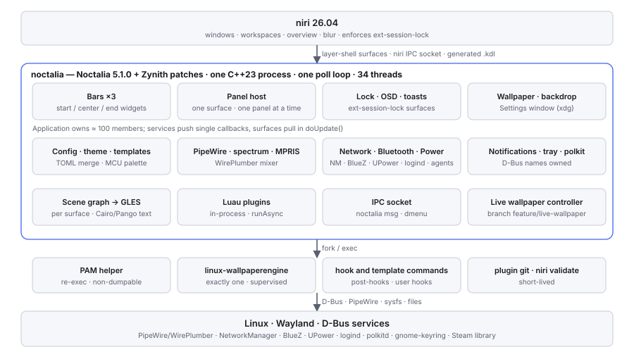

# Zynith — Current Architecture (2026‑10‑02)

**Status:** audit record of what exists today. Nothing in the shell was changed to write it. I asked for this as the
first task of the next phase, before any redesign. Claude inspected the repositories, the build, the running session,
the configuration and the generated files, and measured what is noted as measured. Anything that could not be
established is marked **UNKNOWN / REQUIRES VERIFICATION**.

Evidence tags as in [`DOCUMENTATION_POLICY.md`](../DOCUMENTATION_POLICY.md): **VERIFIED**, **RECOVERED**,
**INFERRED**, **UNKNOWN**. Companion documents: the
[Quickshell study](Zynith-Quickshell-Architecture-Study.md), the
[reference rice study](Zynith-Reference-Rice-Study.md) and the proposal,
[Zynith Architecture 2.0](Zynith-Architecture-2.0.md).

## 1. The short answer

Zynith today is **one native C++23 process**: Noctalia 5.1.0 plus the Zynith patch series. It has no Qt, no QML and
no Quickshell. It draws every shell surface itself through Wayland layer-shell, EGL and OpenGL ES, and it talks to
the system through D-Bus, PipeWire and niri's IPC socket. Everything (services, UI, plugins, theme engine, wallpaper,
lock screen) lives in that process, owned by one `Application` object. A handful of short-lived or supervised child
processes sit beside it.



```
niri 26.04 ── layer-shell surfaces · niri IPC socket · ext-session-lock · wlr-screencopy
   │
noctalia (Noctalia 5.1.0 + Zynith patches) ── one process, one main-thread poll loop, 34 threads
   ├── UI surfaces    bars ×3 · panel host (1 surface, 1 panel at a time) · toasts · OSD · lock · wallpaper
   │                  · backdrop · desktop widgets · dock · Settings (xdg toplevel)
   ├── services       config · theme + templates · wallpaper + live controller · PipeWire + spectrum · MPRIS
   │                  · NetworkManager · BlueZ · UPower · notifications server · tray watcher · polkit agent
   │                  · system monitor · Luau plugins · IPC
   └── render         retained scene graph → GLES per surface; Cairo/Pango/HarfBuzz text into textures
   │
child processes ── PAM helper (re-exec, non-dumpable) · linux-wallpaperengine (one, supervised)
                   · hook and template commands · plugin git fetch · niri validate
   │
system ── PipeWire/WirePlumber · NetworkManager · BlueZ · UPower/power-profiles · logind · polkitd
          · gnome-keyring · Steam library (read-only)
```

## 2. Repositories, branches and what is running

| Item | State | Tag |
|---|---|---|
| Implementation repo | `~/.local/src/noctalia-lockfade/source`, branch `master` at `956765a`, pushed to the private GitHub `master`. **Five files uncommitted**: the unfinished Phase 1 spectrum work (`widget.{h,cpp}`, `bar.cpp`, `pipewire_spectrum.h`, `application_ipc.cpp`), left untouched | VERIFIED (`git status`) |
| Live-wallpaper work | git worktree `~/.local/src/noctalia-lockfade/live-wallpaper`, branch `feature/live-wallpaper` at 651d7b1 (4 commits over `956765a`), not merged, not pushed; clean | VERIFIED |
| **Installed binary** | `~/.local/opt/noctalia/bin/noctalia`, built 2026‑09‑27 09:38; reports `v5.1.0 (1ba8cecacc87-dirty)`. So the running shell is the live-wallpaper branch plus uncommitted changes at build time. Exactly which later commits it contains is **UNKNOWN / REQUIRES VERIFICATION** (rebuild from 651d7b1 to settle) | VERIFIED / UNKNOWN |
| Fallback | Fedora `noctalia-5.1.0-1.fc44`, started by niri if the local binary is missing | VERIFIED (`config.kdl`) |
| Docs repo | `~/Documents/Dev/ZynithShell`, `main` at aad1109, clean before this audit | VERIFIED |
| License | Noctalia 5.1.0 is **MIT** (`LICENSE`: "Copyright (c) 2026 noctalia-dev"); the Fedora package lists MIT plus bundled Apache‑2.0, BSD‑3‑Clause, HPND and LGPL‑2.1+ code. The [Phase 0 audit](phase0-audit-2026-09-26.md) said GPL‑3.0; that was wrong | VERIFIED |

## 3. Which technology is responsible for what

| Component | Implemented by | Where | Tag |
|---|---|---|---|
| Shell framework | Noctalia 5.1.0 native shell (C++23, Meson), no toolkit | `src/` (1,308 files, ≈ 324 k lines) | VERIFIED |
| Noctalia ↔ Zynith | Zynith is a **patch series** on the pristine Fedora SRPM import (first commit 85901ea). It is not a separate program | `git log` | VERIFIED |
| C++ / Qt / QML | C++ only. `ldd` shows no Qt library; the source tree contains no `.qml` file | `ldd`, `find` | VERIFIED |
| Rendering | own retained scene graph (`render/scene`: `Node`, `RectNode`, `TextNode`, `ImageNode`, `WallpaperNode`, …) → OpenGL ES through EGL (`render/backend/gles_*`), one render target per surface, shared GL context. Text: FreeType, HarfBuzz, Pango/Cairo into glyph textures. SVG: librsvg. Images: libwebp, libjxl, stb | `src/render/` (≈ 20 k lines) | VERIFIED |
| Process model | one process, one main thread running a `poll()` loop over ≈ 26 `PollSource` kinds (Wayland, both D-Bus buses, PipeWire, spectrum, timers, IPC, inotify, HTTP…). Worker threads for image decode, thumbnails, Luau scripts, system sampling, template apply, wallpaper scan, secret store, PAM, calendar, screenshots | `src/app/main_loop.cpp`, `grep std::thread` | VERIFIED |
| Composition root | `Application` owns ≈ 100 members: every service, surface, poll source and timer. Wiring is hand-written callbacks in `application_services.cpp` (29 `set*Callback` sites; e.g. 10 places call `m_bar.refresh()`) | `src/app/application.h`, `application_services.cpp` | VERIFIED |
| IPC | `noctalia msg …` → Unix socket `$XDG_RUNTIME_DIR/noctalia-wayland-1.sock` (directory 0700); a second socket serves dmenu mode | `src/ipc/` | VERIFIED |
| niri integration | (1) niri IPC socket: event stream (workspaces, windows, window layouts, focus, overview, keyboard layouts) plus `Action` requests; (2) generated config: `noctalia.kdl` (palette), `rice/animations.kdl`, `rice/glass.kdl` (validated with `niri validate`, written atomically, ADR‑0015/0016) | `src/compositors/niri/` | VERIFIED |
| Other compositors | upstream backends for Hyprland, Sway, KDE, labwc, mango, dwl, … (unused here) | `src/compositors/` | VERIFIED |
| D-Bus | sdbus-c++ on both buses. Names owned on the session bus: `org.freedesktop.Notifications`, `org.kde.StatusNotifierWatcher`, `dev.noctalia.Mpris`, `dev.noctalia.Debug` | `busctl --user list` | VERIFIED |
| Wayland | own client: layer-shell, xdg-shell (Settings window), ext-session-lock, wlr/ext data-control (clipboard), screencopy, output management, foreign toplevels, gamma control, virtual keyboard, text input, cursor shape | `src/wayland/`, `protocols/` | VERIFIED |
| PipeWire / WirePlumber | libpipewire + libwireplumber in-process: device and stream state, volume (`WirePlumberMixer`), spectrum capture (passive monitor stream, FFT 4096 at 60 Hz, listener-counted), sounds (libsndfile) | `src/pipewire/` | VERIFIED |
| NetworkManager | D-Bus client + **secret agent** (Wi‑Fi passwords); iwd agent too | `src/dbus/network/` | VERIFIED |
| BlueZ | D-Bus client + **pairing agent** | `src/dbus/bluetooth/` | VERIFIED |
| UPower / power profiles | D-Bus clients; battery warnings, charge-limit | `src/dbus/upower/`, `src/dbus/power/` | VERIFIED |
| PAM | lock-screen auth; the password is handed to a re-executed helper (`/proc/self/exe pam-helper`) over a pipe. Both processes are non-dumpable and password buffers are wiped (Phase 1) | `src/auth/`, `src/security/` | VERIFIED |
| polkit | the shell is the polkit agent (`polkit_agent = true`); the prompt is a shell panel | `src/dbus/polkit/`, `src/shell/polkit/` | VERIFIED |
| systemd / logind | logind over D-Bus (sleep, lock, session); no unit of its own. niri starts the shell with `spawn-sh-at-startup` | `src/dbus/logind/`, `config.kdl` | VERIFIED |
| Wallpaper (static) | in-process: one background-layer surface per output (`noctalia-wallpaper`), GPU transitions, plus a blurred copy (`noctalia-backdrop`) that niri places in the overview backdrop by a layer rule in `rice/rules.kdl` | `src/shell/wallpaper/`, `src/shell/backdrop/` | VERIFIED |
| linux-wallpaperengine | external GPL‑3.0 renderer built at upstream b016d7d in `~/linux-wallpaperengine/build/output/`. Zynith supervises exactly one instance (`LiveRendererProcess`, pidfd, own process group, `PR_SET_PDEATHSIG`), on the branch only | `src/shell/wallpaper/live/` (branch) | VERIFIED |
| Plugins | Luau, in-process. One enabled: the local `dusk/identity` (lock identity widget). Catalogs from git (official, community), **notify-only** updates since Phase 1 | `src/scripting/` | VERIFIED |
| Themes | Material Color Utilities in-process (`ThemeService`) → palette; template engine renders app themes (kitty, niri, GTK, starship…) and runs post-hooks | `src/theme/` | VERIFIED |
| Animations | one `AnimationManager` per surface, motion roles and springs (Batch 6), `MorphTransition`; niri's own animations generated from the same settings | `src/render/animation/` | VERIFIED |
| Widgets | bar widgets (`src/shell/bar/widgets/`, ≈ 40 types), desktop widgets (`src/shell/desktop/`), lock-screen widgets; each type has a definition file and a settings schema | | VERIFIED |
| Bars | named bars, any number, each on one edge (top/bottom/left/right) with `start/center/end` widget lists, symmetric `margin_ends`, per-monitor overrides, auto-hide and smart auto-hide | `src/shell/bar/`, `BarConfig` | VERIFIED |
| Panels | `PanelManager`: **one layer surface and one active panel at a time**. Panels: control-center (12 tabs), launcher, wallpaper, clipboard, session, tray-drawer, polkit, setup-wizard, test, plus plugin panels | `src/shell/panel/`, `application_ui.cpp` | VERIFIED |
| Settings | an xdg-toplevel window, sidebar of **23 sections**, **496 registry controls** (156 in Bar alone); opens straight into a section (no home) | `src/shell/settings/`, `noctalia config settings-count` | VERIFIED |
| Notifications | in-process D-Bus server → `NotificationManager` → toast surface; history in the Control Center; history file is plain JSON | `src/notification/`, `src/shell/notification/` | VERIFIED |
| Launcher | a panel with providers: apps, calculator (libqalculate), windows, wallpapers, session, emoji, plugins, dmenu | `src/launcher/`, `src/shell/launcher/` | VERIFIED |
| Lock screen | ext-session-lock surfaces per output, widgets from `lockscreen.toml`, wallpaper drawn by the lock surface itself | `src/shell/lockscreen/` | VERIFIED |
| System monitoring | `SystemMonitorService`: one 1 s sampler thread shared by bar, Control Center and desktop widgets; GPU/temperature probes reference-counted | `src/system/` | VERIFIED |
| Clipboard | data-control watcher; history **encrypted at rest** (`index.enc`, `security/encrypted_file_store`). The Phase 0 audit called it plain files; that was wrong for the clipboard | `src/wayland/clipboard_service.cpp` | VERIFIED |

## 4. How the inside fits together

**One owner, explicit wiring.** Services are members of `Application` and expose state plus usually a *single*
change callback. `application_services.cpp` connects each callback to the surfaces that care (often
`m_bar.refresh()` and, if open, the Control Center). There is a `Signal` primitive (41 declarations) used for
fan-out such as palette changes. So shared state exists (one MPRIS client, one sampler, one notification store),
but a reader has to know `Application` to find who reacts to what.

**Pull rendering.** A bar refresh asks every widget of every bar instance to `doUpdate()` and read the services it
uses. Surfaces render only when their scene is dirty or a redraw was requested, so idle cost is near zero. The
exception is continuous content: the bar spectrum renders at up to frame rate while audio plays.

**Panels.** A single panel surface hosts whichever panel is active. Opening another panel replaces the first. The
Control Center is one panel with 12 tabs (home, audio, bluetooth, calendar, media, monitor, network, notifications,
power, screen time, system, weather).

**Bars.** Bars are already multiple and independent (I run three: a left rail, an auto-hidden top media pill and a
bottom time pill). Each bar is a full-edge layer surface; `margin_ends` insets both ends equally, so a bar can be
centred on its edge but cannot be anchored to the start or end of it. "Top-left" and "top-right" bars are therefore
not expressible today. Exclusive space is per bar (`reserve_space`).

**Configuration layering.** Defaults in code → every `*.toml` in `~/.config/noctalia/` merged in sorted order
(mine: `lockscreen.toml`, `rice.toml`) → `~/.local/state/noctalia/settings.toml` (written only by the Settings GUI)
on top. Runtime state goes to `state.toml`. The directory is watched and reloaded.

## 5. Configuration and generated files

| Path | Kind | Owner / writer |
|---|---|---|
| `~/.config/noctalia/rice.toml`, `lockscreen.toml`, `palettes/` | Zynith design layer, hand-edited | me |
| `~/.local/state/noctalia/settings.toml` | GUI overrides (+ `.lockscreen_widgets.stash`) | Settings window only |
| `~/.local/state/noctalia/state.toml` | runtime state incl. `[wallpaper_live]`, `[wallpaper_panel]` | the shell |
| `~/.local/state/noctalia/` (other) | notification history (JSON), clipboard (encrypted), screen time, usage counts, plugin sources and materialised plugins | the shell |
| `~/.cache/noctalia/` | thumbnails (WebP), weather/location JSON, avatar, logs (47 MB) | the shell |
| `~/.config/niri/config.kdl`, `rice/binds.kdl`, `rice/rules.kdl` | niri config, hand-written | me |
| `~/.config/niri/noctalia.kdl` | generated palette, must stay the last include | the shell (template) |
| `~/.config/niri/rice/animations.kdl`, `rice/glass.kdl` | generated niri fragments | the shell (ADR‑0015/0016) |
| `~/.config/systemd/user/swaync.service.d/10-skip-under-niri.conf` | keeps swaync off the notification bus under niri | Zynith rice |
| `~/.local/share/zynith/sounds/` | shell sounds | Zynith rice |
| `~/.local/share/noctalia/plugins/identity/` | local Luau plugin | Zynith rice |
| `~/.config/zynith/` | **new (this audit)**: Zynith root; holds the test, benchmark and helper scripts and a README mapping everything above | Zynith |
| `~/.cache/zynith/` | screenshots, logs, old test binaries, research frames (≈ 470 MB) | Zynith work sessions |
| `~/.config/quickshell/` | an older Hyprland-era Caelestia clone (Feb–Mar 2026); its `qml_color.json` was rewritten on 2026‑10‑01 by something **UNKNOWN** | not Zynith |
| `/etc/xdg/autostart/nm-applet.desktop`, `blueman.desktop` | system autostart of the duplicate agents (still running) | Fedora packages |

Moved during this audit (ownership verified from each script's header and history): 28 scripts from
`~/.cache/zynith/` to `~/.config/zynith/scripts/` (`helpers/`, `benchmarks/`, `tests/`); internal calls to `pstat.sh` and
`zinput.py` updated; each script syntax-checked with its own shell. Nothing else moved: `rice.toml` cannot leave
`~/.config/noctalia/` while the shell only reads that directory (a symlink would load but break hot reload).

## 6. Wallpaper architecture

**Static.** `Wallpaper` owns per-output background surfaces and transitions; the path per output is in config
(`ConfigService::getWallpaperPath`). `Backdrop` draws a blurred copy of the same path for niri's overview. The
browser panel (grid or Zynith carousel) uses a session-scoped `ThumbnailService` (WebP disk cache, tiered decode).
Favourites and per-wallpaper palettes are config; shuffle state is JSON.

**Live (branch).** `LiveWallpaperController` (state machine) → `WallpaperEngineProvider` (Steam layout, 561 items
discovered, catalog on a worker thread) → `LiveRendererProcess` (exactly one `linux-wallpaperengine`). Hand-over
uses the static surface: on a switch the shell shows the next item's **preview as a poster** until the renderer
draws, then releases its surface for that output. The palette source is overridden to the preview. State in
`state.toml [wallpaper_live]`: mode, current, favourites (26), collection (132), recent, category, carousel.
At audit time the mode was `static`.

### 6.1 Live wallpaper missing on the lock screen and in the overview: cause

VERIFIED in code (branch at 651d7b1):

- The lock screen draws its own wallpaper from `LockScreen::wallpaperPathForOutput()` →
  `ConfigService::getWallpaperPath()` (`lock_screen.cpp:698`). The backdrop does the same (`backdrop.cpp:129`).
  That path is the **last static wallpaper**. The live controller overrides only the *palette* source
  (`getPaletteWallpaperPath`) and hands over the desktop surface. So there is **no single "what is on the desktop
  now" state**. Four consumers (desktop, backdrop, lock, palette) each resolve "the wallpaper" separately, and
  only two of them know about live mode.
- The live content is pixels in **another process's surface** (`linux-wallpaperengine` namespace). The shell cannot
  sample it: niri offers whole-output screencopy but no `ext-image-copy-capture` (globals checked with a Wayland
  debug trace), and a whole-output capture would contain windows.
- Under `ext-session-lock` the compositor shows only lock surfaces, so the renderer cannot show through the lock.
  It keeps running behind it anyway (documented limitation): GPU work nobody sees.
- In the overview, niri draws background-layer surfaces inside each workspace. With no `place-within-backdrop`
  rule for `linux-wallpaperengine`, the live wallpaper moves with the workspaces while the backdrop between them
  shows Zynith's blurred **static** image.

### 6.2 Wallpaper menu sections not updating immediately: cause

**INFERRED** from code; the exact symptom I see has not been reproduced in this audit, so the specific trigger
**REQUIRES VERIFICATION** with me at the machine. The panel (`wallpaper_panel.cpp`, 2,725 lines) keeps derived
view state of its own (visible entries, selection, carousel focus, promotion window, loading flag) in addition to
the controller's category. Each control handler re-derives it by calling its own hand-picked sequence of
`rebuild…`, `rebind…`, `sync…` functions, and the sequences differ:

- The Live **category** handler (`wallpaper_panel.cpp:896–907`) calls `rebuildLiveEntries()`, which recomputes
  `m_scanPending`, but never `syncLoadingState()`. The spinner/carousel visibility therefore stays as it was until
  a later controller change (deferred through `DeferredCall`) happens to call it. The **tab** handler and
  `onLiveChanged()` do call it.
- Live thumbnails are not resident like static ones: the Live tab prefetches only the 64 cards around focus, so a
  newly selected section fills in as worker decodes arrive. That is by design (bounded memory) but reads as "not
  updated" for the first frames.

The architectural cause is the same in both: **view state derived by hand in many places instead of computed from
one state**. A missed step leaves the view stale until something else happens to repair it.

## 7. Performance facts

| Measurement | Value | Conditions | Tag |
|---|---|---|---|
| Startup, spawn → wallpaper visible | 430–506 ms (was 1.03–1.17 s) | branch commit 4f4169c; 5 shell restarts | VERIFIED ([startup benchmark](../03_Performance/benchmarks/startup-unlock-2026-09-27.md)) |
| Service init on the critical path | 579 ms, mostly blocking D-Bus round-trips (NM secret agent ≈ 280 ms) | real login 2026‑09‑27 | VERIFIED (same) |
| Idle, no audio | ≈ 0.3 % of one core (3 ticks / 10 s) | Batch 7 clean build | VERIFIED (Phase 0) |
| While audio plays | 6.2 % shell + 9.7 % niri (4 streams, bar spectrum at frame rate) | Phase 0 | VERIFIED |
| Today, 30 s sample | 86 ticks (≈ 2.9 %) shell, 27 ticks niri | 2026‑10‑02 11:31, 2 uncorked streams, audibility unknown | VERIFIED |
| Footprint now | RSS 128 MB, 34 threads, 97 fds, non-dumpable | `noctalia msg status`, uptime 3.5 h | VERIFIED |
| Theme apply on restart | 245–342 forks (was ≈ 2,500) | Phase 1 `956765a` | VERIFIED |
| Clean build | 974 s at `-j 10` | live-wallpaper benchmark | VERIFIED |
| Live renderer | scene ≈ 225 MB / 5 %; video 359 MB / 79 % (software decode); web ≈ 1.3 GB / 10 processes | standalone | VERIFIED |

Bottlenecks known: the bar spectrum during playback (Phase 1 fix written, uncommitted); service init blocking the
first frame (mitigated by the early background); the live renderer running while locked or covered; video
wallpapers decoding in software (renderer-side); the 974 s clean build that every header-layout change requires
(ADR‑0013).

## 8. Security boundaries today

| Boundary | State |
|---|---|
| Lock / PAM | ext-session-lock; PAM in a re-exec'd helper; both non-dumpable; password copies wiped; reload deferred while locked |
| Other password entry | polkit prompt, Wi‑Fi secret prompt and Bluetooth pairing are panels **in the same process** as everything else |
| Plugins | Luau with `luaL_sandbox` (restricted standard library), **but** the API exposes `runAsync` incl. `/bin/sh -c` (`luau_host.cpp:2381`): an enabled plugin runs commands as me. No permission model. Updates notify-only |
| Hooks and templates | user-configured commands on events and after theme apply; now capability-gated and only on change (Phase 1) |
| IPC | socket in `$XDG_RUNTIME_DIR` (0700): any process of mine can drive the shell, including `wallpaper-live-set` |
| Data at rest | clipboard encrypted; notification history plain JSON; screen time and usage plain |
| Duplicates | `nm-applet` and `blueman` still run beside the shell's own agents (Phase 1 item open) |

## 9. Architectural weaknesses (for the 2.0 work)

1. **Everything in one process.** A crash in a widget, plugin or the theme engine takes down the lock screen's
   host too (ext-session-lock keeps the session locked, but the UI is gone).
2. **Comprehension cost.** ≈ 324 k lines, an `Application` with ≈ 100 members, and wiring spread over callbacks.
   Finding "where does this belong" requires reading the composition root.
3. **Iteration cost for UI.** Every visual change is C++: build, install, restart; a header change means a 16-minute
   clean build.
4. **Panels are exclusive.** One panel surface, one active panel; the Control Center grows by tabs.
5. **Bars cannot anchor to the start or end of an edge.**
6. **No single wallpaper state** (§6.1), and **hand-derived view state** (§6.2).
7. **Upstream divergence.** Zynith patches a moving MIT project; each upstream release is a merge.
8. Secrets are entered in the same process as plugins and third-party content.

## 10. UNKNOWN / REQUIRES VERIFICATION

- Which branch commits are in the installed binary (§2).
- The exact reproduction of the wallpaper section bug (§6.2).
- Whether two bars on the same edge that both reserve space stack their exclusive zones in niri (INFERRED yes,
  not tested).
- What rewrote `~/.config/quickshell/qml_color.json` on 2026‑10‑01.
- Which of the duplicate agents (shell vs `nm-applet`/blueman) answers a Wi‑Fi password or pairing request.
