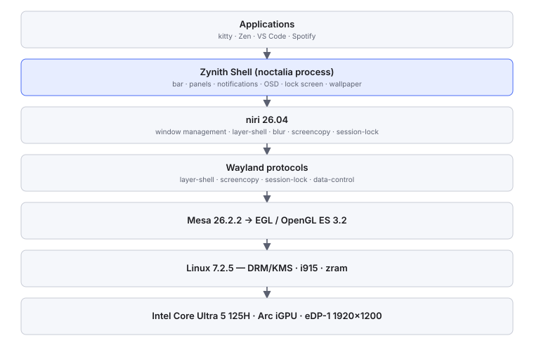

# Architecture Overview

A one-page map. Every claim here is expanded, with evidence, in `02_Architecture/`.



## The three layers of Zynith

| Layer | Artifact | Changes require |
|---|---|---|
| **Configuration** | `rice.toml`, `rice/*.kdl`, `lockscreen.toml` | an editor and a reload |
| **Plugins** | `identity`, `motion` (Luau) | an editor; no rebuild |
| **Patch** | 15 commits over Noctalia 5.1.0 (16 including the pristine base) | a rebuild and an install |

The ordering is a rule, not an accident: **anything expressible as configuration is configuration.** The Phase 6
bar redesign contains no C++ at all; the carousel does, because no configuration surface could express it.

## Shell internals that matter most

```
   Application (one process)
     ├── Wayland connection ──── layer-shell surfaces: bar · panels · toast · OSD · lock · wallpaper
     ├── AnimationManager ────── one engine, one tick, reentrancy contract
     ├── TimerManager ────────── one-shot and repeating timers (dwell, hover intent, settle)
     ├── Signal ──────────────── observer primitive; palette changes fan out through it
     ├── ThumbnailService ────── shared image cache: sessions, tiers, decode gate, idle LRU
     ├── ThemeService ────────── wallpaper → Material-3 palette, animated transition
     ├── ConfigService ───────── TOML merge, schema validation, inotify reload
     └── PanelManager ────────── panel lifecycle, reveal/close animation, modal backdrop, retargeting
```

Two of these — `Signal` and `AnimationManager` — are touched by everything and have caused the project's only
crash. Read `02_Architecture/animation/lifetime-and-motion.md` before modifying either.

## Data flows

| Flow | Diagram |
|---|---|
| Animation | `07_Assets/diagrams/animation-pipeline.svg` |
| Wallpaper | `07_Assets/diagrams/wallpaper-pipeline.svg` |
| Notifications | `07_Assets/diagrams/notification-pipeline.svg` |
| Configuration | `07_Assets/diagrams/configuration-precedence.svg` |

## Invariants

1. **Focus ≠ apply** in the wallpaper browser. Scrolling, arrows and clicking a neighbour never apply.
2. **One animation engine.** No component runs a frame clock; dwells use `TimerManager`.
3. **No polling, no daemons, no per-event subprocesses.**
4. **Bounded caches.** Every cache has a budget and an owner; browser resources die with the browser.
5. **`settings.toml` has one writer** — the Noctalia GUI.
6. **Generated config is validated then replaced atomically** (`animations.kdl` via `niri validate`).
7. **The packaged shell remains a working fallback.**
